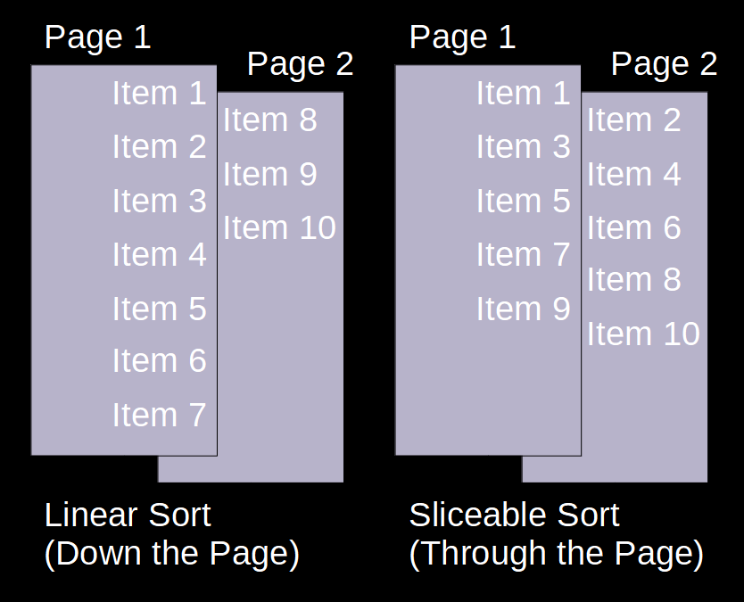

# qrCodeImageSorter

## Project Outline
---

This is a python module which is designed to assist in the easy capture and sorting of photos. 
It aims to solve a problem I have identified where a large number of photos need to be taken 
in a structured manner. While there are apps which aim to acheive this natively on device, 
these can sometimes make sharing of the task difficult. They are often also not as fast as 
the native camera apps, also sometimes missing some of the native post-processing on phones.

This tool will allow users to produce a simple list of QR codes that can be used as indices 
in the photos. The photos will then be split into folders based on the content of the QR 
codes.

## Operational Philosophy
---

The principal of this tool is to generate QR codes which can be printed and included in the photo
set being captured. Images with QR codes included will be detected and used as index photos. Any
photos found after (and including) the index photo, up to the next index photo, will be sorted 
into a directory as indicated by the QR code. Photos will be processed in file name order as
this is consistent with the capture method of all phones and cameras I have personally used.

All sorting is done through copying. The original files are left in-place and unmodified.

QR codes may appear in the images in any order. As the directory is determined by the QR code,
it will be sorted accordingly. The same code may also appear multiple times and will simply add
the additional content to the resulting directory.

### Sorting Exceptions
---
#### Non-Images
As the tool is targetting images, any files which are not images will be copied into the
directory `non_image_files/` under the target output directory.
#### Files Before Index Image
If there are images which appear before the first QR-containing image will be copied into
the directory `unsorted/`.

### Example Input Images


## Installation
---

The package is available on PyPi and can be installed with the following command:

```pip install qrImageIndexer```

If you are not using Windows you will also need to install the zBar binaries (these are included
in the wheel for Windows users): https://pypi.org/project/pyzbar/

## Instructions
---

### Tool Command Line Arguments
---

To use the tool run the command:

```python -m qr_image_indexer```

Command line useage is as per below:
```
usage: __main__.py [-h] [-g INPUT_TEXT_FILE OUTPUT_PDF | -s INPUT_DIR OUTPUT_DIR] [--pdf-type SORT_TYPE] [-q] [-r] [-p STRING_PREFIX] [-v]

options:
  -h, --help            show this help message and exit
  -g INPUT_TEXT_FILE OUTPUT_PDF, --generate-pdf INPUT_TEXT_FILE OUTPUT_PDF
                        Generate a PDF of QR codes from a given text file. Specify
  -s INPUT_DIR OUTPUT_DIR, --sort-photos INPUT_DIR OUTPUT_DIR
                        Sort photos based on QR codes found in photos. Once a QR code is found all photos will be sorted into the directory indicated by the code until subsequent codes found
  --pdf-type SORT_TYPE  Type of PDF to generate. Either linearly sorted or sorted to enable easy slicing of the printed pages. Accepts "linear" or "sliceable". Linear will sort down page, sliceable will sort "through" the page.
  -q, --qr-for-headings
                        Generate a QR code for each heading, not just a code for the last items in a tree.
  -r, --repeat-table-headings
                        Repeat table headings on every line
  -p STRING_PREFIX, --string-prefix STRING_PREFIX
                        Specify a prefix for use in the generated QR codes to differentiate from codes that might also end up in photos
  -v, --verbose         Turn progress text to terminal on or off
```

### General usage
---

In general usage the user will generate QR codes from a text file. These QR codes will then be used as index cards while taking photos. Any photos
which appear subsequent to a QR code but before the next QR code will be sorted into a folder. Any photos which appear before a QR code will be sorted
 into a specific folder of their own.

#### PDF Format
---

For ease of use it is recommended to use the `--pdf-type sliceable` option, which will allow, when printed single-sided, for the QR codes to be easily sliced
and stacked for use in-order.



#### File Format
---

Expected input file format is as a tab indented list. Each level of indentation is considered a child tested below the preceeding level. When photos are sorted
these nested elements will form the file paths. **Additional file formats could easily be added
and may be a good first issue for anyone who wishes to contribute.** An example input file is shown below:

```
Line 1
    Line 1 1st indent item 1
        Line 1 2nd indent
    Line 1 1st indent item 2
Line 2
Line 3
Line 4
Line 5
Line 6
```

In this case photos under `Line 1 1st indent item 1` would appear in the directory `Line 1/Line 1 1st indent item 1/` and photos under `Line 1 2nd
indent` will appear in the directory `Line 1/Line 1 1st indent item 1/Line 1 2nd indent/`.

Generally it is recommended that folder structure be used to sort and plan photo capture logically. E.g. level 1 of the
structure may be particular rooms, level 2 may be objects in the room and level 3 may be specifics about the object.

There is no limit on the number of levels that may be included in the document, but higher numbers will result in messier/busier output PDFs.

#### Other Recommended Options
---

Other options such as `-r` which will result in the headings from further up the tree being repeaded in the output PDF and `-q` which will generate QR codes for headings as well as the tails of the tree may both also be useful.

If it is expected that other QR codes may be present, a prefix can also be added to the QR code package. This can be done with the `-p` option.

Using the option `-v` for any operations will provide verbose status output to the command line.

#### Generating PDF Document
---

Assuming that the above demo file is saved as `demo.txt` the following command would generate a PDF with repeated headings and qr codes for each line in a sliceable format, with the prefix `{image}`:

```python -m qr_image_indexer -g demo.txt demo.pdf -r -q --pdf-type sliceable -p "{image}"```

#### Sorting Images
---

After taking photos, these images could then be sorted into a folder called `outputs\` from a folder called `inputs\` as shown below:

```python -m qr_image_indexer -s inputs\ outputs\ -p "{image}"```

## Future Features
---

Currently the module is command line only. In future this will be expanded to include a GUI
which will simplify the generation of QR codes and the scanning of images for users.
